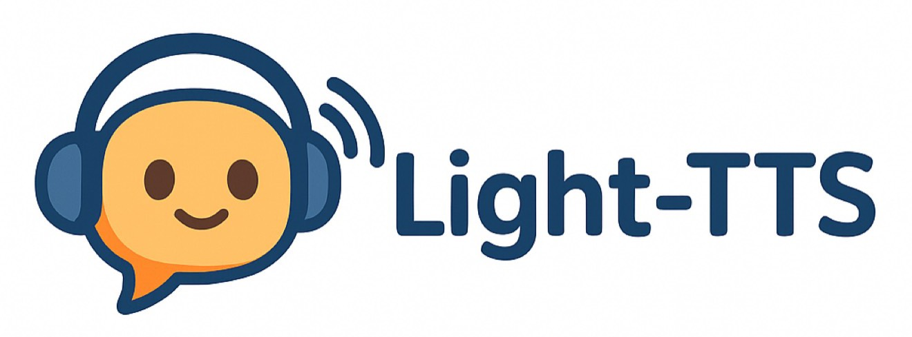

# light-tts

**light-tts** is a lightweight and high-performance text-to-speech (TTS) inference and service framework based on Python. It is built around the [cosyvoice](https://github.com/FunAudioLLM/CosyVoice) model and based on the [lightllm](https://github.com/ModelTC/lightllm), with optimizations to support fast, scalable, and service-ready TTS deployment.

---

## ✨ Features

- 🚀 **Optimized LLM Inference**: The language model part of the TTS pipeline is accelerated using techniques from lightllm and supports high-throughput batch inference
- 🧩 **Shared Memory Timbre Manager with LRU**: Manages speaker/timbre embeddings in shared memory for fast access and minimal recomputation
- 🧱 **Modular Architecture (Encode–LLM–Decode)**: Refactored from LightLLM into three decoupled modules—Encoder, LLM, and Decoder—each running as separate processes for efficient task parallelism and scalability.
- 🌐 **Service Ready and Easy Integration**: Comes with an HTTP API for fast deployment and simple APIs for integration into other Python or web projects
- 🔄 **Bi-streaming Mode via WebSocket**: Supports interactive bi-directional streaming using WebSocket for low-latency, real-time TTS communication
---

## ⚡️ Get Started

### Installation

- Installing with Docker
    ```bash
    # The easiest way to install Lightllm is by using the official image. You can directly pull and run the official image
    docker pull lighttts/light-tts:v1.0

    # Or you can manually build the image
    docker build -t light-tts:v1.0 .

    # Run the image
    docker run -it --gpus all -p 8080:8080 --shm-size 4g -v your_local_path:/data/ light-tts:v1.0 /bin/bash

- Installing from Source

    ```bash
    # Clone the repo
    git clone --recursive https://github.com/ModelTC/light-tts.git
    cd light-tts
    # If you failed to clone the submodule due to network failures, please run the following command until success
    # cd light-tts
    # git submodule update --init --recursive

    # (Recommended) Create a new conda environment
    conda create -n light-tts python=3.10 -y
    conda activate light-tts

    # pynini is required by WeTextProcessing, use conda to install it as it can be executed on all platforms.
    conda install -y -c conda-forge pynini==2.1.5
    pip install -r requirements.txt -i https://mirrors.aliyun.com/pypi/simple/ --trusted-host=mirrors.aliyun.com

    # If you encounter sox compatibility issues
    # ubuntu
    sudo apt-get install sox libsox-dev
    # centos
    sudo yum install sox sox-devel
    ```

### Model download

We now only support CosyVoice2 model.

```python
# SDK模型下载
from modelscope import snapshot_download
snapshot_download('iic/CosyVoice2-0.5B', local_dir='pretrained_models/CosyVoice2-0.5B')
snapshot_download('iic/CosyVoice-ttsfrd', local_dir='pretrained_models/CosyVoice-ttsfrd')
```
```python
# git模型下载，请确保已安装git lfs
mkdir -p pretrained_models
git clone https://www.modelscope.cn/iic/CosyVoice2-0.5B.git pretrained_models/CosyVoice2-0.5B
git clone https://www.modelscope.cn/iic/CosyVoice-ttsfrd.git pretrained_models/CosyVoice-ttsfrd
```

For better text normalization performance, you can optionally install the ttsfrd package and unzip its resources. This step is not required — if skipped, the system will fall back to WeTextProcessing by default.

```bash
cd pretrained_models/CosyVoice-ttsfrd/
unzip resource.zip -d .
pip install ttsfrd_dependency-0.1-py3-none-any.whl
pip install ttsfrd-0.4.2-cp310-cp310-linux_x86_64.whl
```
📝 This setup instruction is based on the original guide from the [CosyVoice repository](https://github.com/FunAudioLLM/CosyVoice).

### Start the Model Service

```bash
# It is recommended to enable the load_trt parameter for acceleration.
# The default is fp16 mode.
python -m light_tts.server.api_server --model_dir ./pretrained_models/CosyVoice2-0.5B-latest --load_trt True --max_total_token_num 65536 --max_req_total_len 32768
```

- max_total_token_num: llm arg, the total token nums the gpu and model can support, equals = `max_batch * (input_len + output_len)`
- max_req_total_len: llm arg, the max value for `req_input_len + req_output_len`, 32768 is set here because the `max_position_embeddings` of the llm part is 32768
- There are many other parameters that can be viewed in `light_tts/server/api_cli.py`

Wait for a while, this service will be started. The default startup is localhost:8080.

### Request Examples

When your service is started, you can call the service through the http API. We support three modes: non-streaming, streaming and bi-streaming.

- non-streaming and streaming. You can also use `test/test_zero_shot.py`, which can print information such as rtf and ttft.


    ```python
    import requests
    import time
    import soundfile as sf
    import numpy as np
    import os
    import threading
    import json

    url = "http://localhost:8080/inference_zero_shot"
    path = "cosyvoice/asset/zero_shot_prompt.wav" # wav file path
    prompt_text = "希望你以后能够做的比我还好呦。"
    tts_text = "收到好友从远方寄来的生日礼物，那份意外的惊喜与深深的祝福让我心中充满了甜蜜的快乐，笑容如花儿般绽放。"
    stream = True  # Whether to use streaming inference
    files = {
        "prompt_wav": ("sample.wav", open(path, "rb"), "audio/wav")
    }
    data = {
        "tts_text": tts_text,
        "prompt_text": prompt_text,
        "stream": stream
    }
    response = requests.post(url, files=files, data=data, stream=True)
    sample_rate = 24000

    audio_data = bytearray()
    try:
        for chunk in response.iter_content(chunk_size=4096):
            if chunk:
                audio_data.extend(chunk)
    except Exception as e:
        print(f"Exception: {e}")
        print(f"Error: {response.status_code}, {response.text}")
        return
    audio_np = np.frombuffer(audio_data, dtype=np.int16)
    if response.status_code == 200:
        output_wav = f"./outs/output{'_stream' if stream else ''}_{index}.wav"
        sf.write(output_wav, audio_np, samplerate=sample_rate, subtype="PCM_16")
        print(f"saved as {output_wav}")
    else:
        print("Error:", response.status_code, response.text)
    ```

- bi-streaming. We use the websocket interface implementation, and we can find usage examples in `test/test_bistream.py`.

## License
This repository is released under the [Apache-2.0](LICENSE) license.